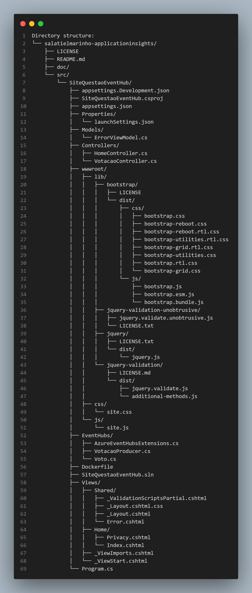

# ASPNETCore8-MVC-AzureEventHubs-AppInsightsConnString_Enquete
Exemplo de geração de eventos envolvendo o voto em uma enquete sobre o dia favorito da semana, utilizando o Azure Event Hubs em uma Web App criada com o .NET 8 + ASP.NET Core. Inclui o uso de um Dockerfile para geração de imagens Linux, além de monitoramento com o Azure Application Insights (utilizando Connection String).

## Estrutura de Diretório

 

## Instalação 

1. **Clone o Repositório:** Primeiro, faça o clone do repositório para o seu ambiente local. Utilize o comando abaixo no terminal ou prompt de comando:

` git clone https://github.com/salatielmarinho/applicationinsights.git `

2. **Acesse o Diretório do Projeto:** Navegue até o diretório onde o repositório foi clonado:

` cd salatielmarinho-applicationinsights `

3. **Instale as Dependências:** Certifique-se de ter o .NET SDK instalado na sua máquina. Em seguida, instale as dependências do projeto:

` dotnet restore `

4. **Configuração de Ambiente (Opcional):** Verifique os arquivos de configuração `appsettings.Development.json` e `appsettings.json` para ajustar as configurações conforme necessário.

5. **Compilar e Executar o Projeto:** Compile o projeto e, em seguida, execute-o:

` dotnet build
dotnet run
`

6. **Acesse a Aplicação:** Após a execução, a aplicação estará disponível. Normalmente, será acessível via `http://localhost:5000` ou `http://localhost:5001` (HTTPS).

## Author

:boy: [Salatiel Marinho](https://github.com/salatielmarinho)